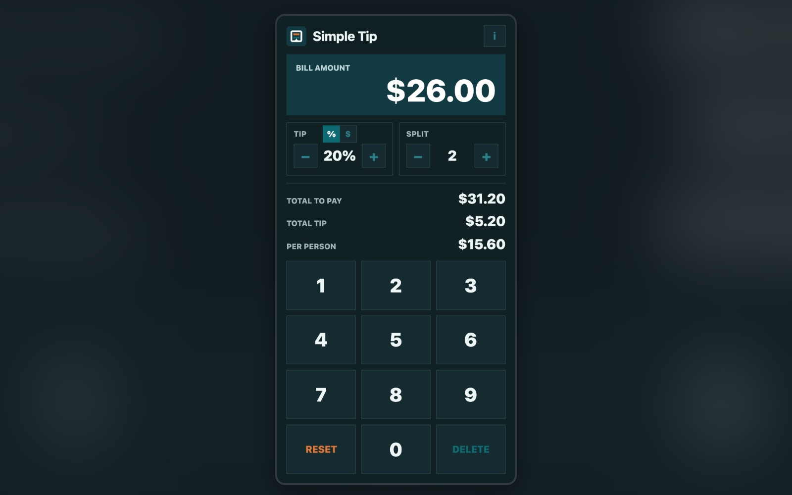

# Simple Tip

A small installable tip calculator inspired by an old Android app I used to use.

## Screenshot

## Features

- keypad bill entry where `1234` means `$12.34`
- Reset and Delete keys in the phone-keypad positions
- tip stepper that works in percent or whole dollars: flip the `%` / `$` toggle to leave an exact tip amount, and the app shows the effective tip rate
- bill split stepper
- press and hold either stepper to change it quickly
- instant total, tip, and per-person totals
- responsive layout that fits phone screens without scrolling
- opens fresh every time at a 20% tip, split one way
- no ads, no third-party requests, no permissions, no tracking, nothing saved on your device, no bs

## Stack

- Vanilla HTML, CSS, and JavaScript (ES modules). No framework, no build step, no dependencies.
- Installable PWA: a web app manifest plus a network-first service worker, so the app picks up new versions when online and still works offline.
- All money math is done in integer cents in `calc.js` to avoid floating-point rounding errors.
- Unit tests use Node's built-in test runner: `node --test`
- Hosted on GitHub Pages.

## Install On A Mobile Device

Open the GitHub Pages URL in the device's web browser:

https://mint85.github.io/simple-tip/

Then choose **Add to Home screen** or **Install app** from the browser menu.

After the first load, the app keeps working offline. When you're online it loads the latest version, falling back to the saved copy if the connection is slow or missing.

---

This project has been developed with AI assistance (originally Codex, now Claude Code).
